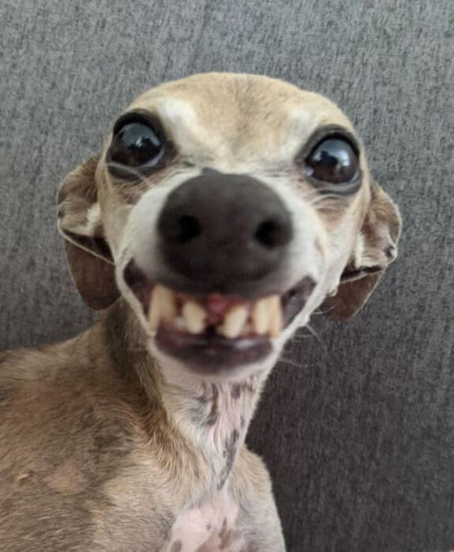

o4ko
<!DOCTYPE html>
<html lang="ru">
<head>
    <meta charset="UTF-8">
    <title>Моя визитка</title>
    
</head>
<body>
    <h1>Hi</h1>
    
    

        Привет! Меня зовут зенин игорь.
    

    

        <strong>Зенин Игорь</strong>
    

    

        Связаться со мной: 
        Email: <a href="mailto:example@mail.ru">shakexsea@rambler.ru</a> 
        Telegram: <a href="https://t.me/mickyu42">@mickyu42</a>
    

</body>
</html>
